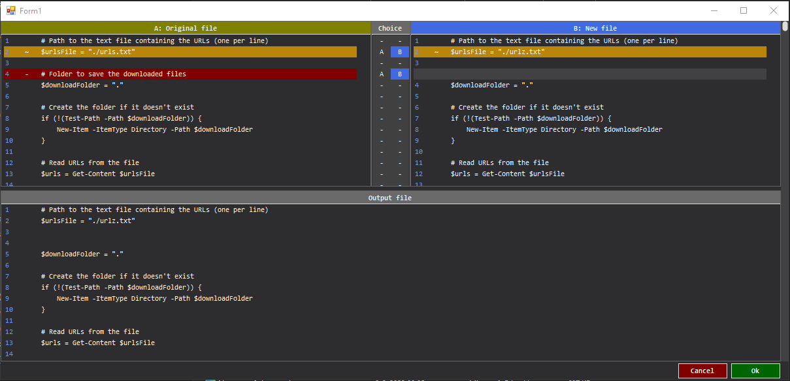

# DiffMergeViewer — Custom File Merge Control for WinForms

A highly customizable Visual Basic .NET (VB.NET) WinForms control for viewing and manually merging two versions of a file, with synchronized scrolling, visual diff indicators, and custom scrollbar styling.

## ✨ Features

- Two side-by-side `ListView` panels for visualizing "original" (left) and "modified" (right) file contents
- Color-coded line indicators:
  - `+` Added (Green)
  - `-` Removed (Red)
  - `*` Modified (Yellow)
  - ` ` Unchanged (Default)
- Third panel showing merge results with manual control
- External, fully styled vertical scrollbar
- Mouse wheel support with synchronized scrolling across all views
- Custom scrollbar with rounded thumb, custom color, and smooth rendering
- Overflow-safe mouse delta handling (even in 64-bit Release builds)
- No reliance on Git or external merge tools

## 🛠 Usage

### Integration Steps

1. Add a reference to DiffMergeView.dll in your project.

2. Add the latest newtonsoft.json package to your project

3. Checkout the DiffMerge project -> Form1 to see the implementation and then just apply to your own form

4. Use `DiffPlex` or another diffing method to compare the old and new file contents line-by-line.

🖼 Screenshot

🧰 Requirements
- .NET Framework 4.8
- Windows Forms
- DiffPlex library (optional, for generating diff model)

🔒 License
MIT

Built by a developer who's done battling ListView scrollbars and survived to tell the tale. 😉
